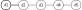
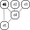
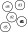
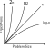

# Fundamentals of Python: Datastructures
## Kenneth A. Lambert - Cengage Learning (2014)

* All examples to be worked through with Python 3.8 using as many of the new 
features as possible

# C01. Basic Python Programming
This was a review of the Python standard library.

# C02. An Overview of Collections

There are several data types that we're already familiar with in Python;
strings, lists, tuples, dictionaries etc.

There are others such as stacks, queues, priority queues, binary search trees,
heaps, graphs, bags and various sorted collections.

They can be *homogenous* (all of the same type) or *heterogenous*.  For most
languages, collections have to be homogenous, but not for Python.

Collections are usually *dynamic*, rather than *static*, they can grow or shrink
depending on need.  They often can change throughout the course of a program,
except of course for *immutable collections*.

We generally categorize them by their structure.

## Collection Types
### Linear Collections
Items in a *linear collection* are like people in a line, ordered by position.  Each (except the first)
has a predecessor and one or zero successors.



### Hierarchical Collections
Family trees and corporate structures are familiar examples of *hierarchical 
collections*.  Each object except the one at the top has a parent, but possibly
many successors, aka *children*.
 


### Graph Collections
A *graph collection* or more simply, *graph* has objects where each data item
can have many predecessors and many successors.  In Fig 2.3 all objects touching
d4 are both its predecessors and successors, we call these *neighbours*.



### Unordered Collections
In an *unordered collection* there is no particular order at all, no 
predecessors, no successors. Anarchy!



### Sorted Collections.
A *sorted collection* has a *natural ordering* on its items.  Things like
a phone book or roster are examples.  There must be some kind of rule for
comparing items such that `item<sub>n</sub> <= item<sub>n+1</sub>`.  Sorted
lists are the most familiar but a subtype of hierarchical collections, the 
*binary search tree* imposes a natural ordering on its items.

Some operations such as searching can be much more efficient on a sorted
collection than on an unsorted equivalent.

### A Taxonomy of Collection Types

* Collection
  * Graph Collection
  * Hierarchical collection
    * Binary Search Tree
    * Heap
  * Linear collection
    * List
      * Sorted list
    * Queue
      * Sorted queue
    * Stack
    * String
  * Unordered collection
    * Bag
      * Sorted bag
    * Dictionary
      * Sorted dictionary
    * Set
      * Sorted set

### Implementations of Collections
In computer science we call collections *Abstract Data Types* (ADTs).  By
abstracting away the details we don't need to worry about we can concentrate
on the important details about how to most efficiently work with them within
the constraints of both memory and time.

In Python we abstract things by using (in order from smallest to largest forms
of abstractions) functions, methods, classes and modules.

Remember you can always explore the interfaces of a collection type by using
the `dir()` or `help()` methods on them from a shell prompt.
 
 ```python
>>> dir(list)

['__add__', '__class__', '__contains__', '__delattr__', '__delitem__', '__dir__', '__doc__', '__eq__', '__format__', '__ge__', '__getattribute__', '__getitem__', '__gt__', '__hash__', '__iadd__', '__imul__', '__init__', '__init_subclass__', '__iter__', '__le__', '__len__', '__lt__', '__mul__', '__ne__', '__new__', '__reduce__', '__reduce_ex__', '__repr__', '__reversed__', '__rmul__', '__setattr__', '__setitem__', '__sizeof__', '__str__', '__subclasshook__', 'append', 'clear', 'copy', 'count', 'extend', 'index', 'insert', 'pop', 'remove', 'reverse', 'sort']

>>> help(list)

Help on class list in module builtins:
class list(object)
 |  list(iterable=(), /)
 |  
 |  Built-in mutable sequence.
 |  
 |  If no argument is given, the constructor creates a new empty list.
 |  The argument must be an iterable if specified.
 |  
 |  Methods defined here:
 |  
 |  __add__(self, value, /)
 |      Return self+value.
 |  
 |  __contains__(self, key, /)
 |      Return key in self.
 ...
...
...
```

## Ch. 3 Searching, Sorting and Complexity Analysis
An algorithm is a computational process that halts with the solution to a
problem.  There are criteria for measuring the quality of an algorithm,
obviously correctness is the most important.  The second most important is
generally speed.

When run on a real computer with finite resouces, other economies come in to
play.  Everything is a tradeoff between processing time and space and memory.

In this section we'll be introducing tools for complexity analysis - 
assessing the runtime performance or efficiacy of algorithms and then to
apply those to search and sort algorithms.

### Measuring the Efficiency of Algorithms
When choosing algorithms, you often have to settle for a space/time tradeoff.  
To make valid decisions you need to know how to measure them.

### Measuring the Run Time of an Algorithm
Using the computer's clock to measure the run time of an algorithm is 
called *benchmarking* or *profiling* basically you start by determining the
time the algorithm takes to process a small data set, then do the same on
larger and larger datasets so you predict how it will perform on datasets
of any size.

[This program](examples/0301_timing.py) implements a algorithm that counts from 1 to a given
number.  

The problem size is the number. You could start with the number 10,000,000
time the algorithm and output the runtime.  Then you can double the number
and rerun the program.  After you do so 5 or so times you have an idea of
the efficiacy of the program.
  
```text
Problem Size         Seconds
    10000000           1.319
    20000000           2.638
    40000000           5.276
    80000000          10.542
   160000000          21.105
```
We can see that the runtime increases linerarly with the problem size.

However if we change the code to include a nested loop like:

```python
for j in range(problemSize):
  for k in range(problemSize):
    work += 1
    work -+ 1
```

It runs so long we don't bother measuring.  If we lower the problem to 1000, we
then get results - we see that when the problem size doubles, the time to run
increases 4x! 

```text
Nested loop:
Problem Size         Seconds
        1000           0.098
        2000           0.404
        4000           1.641
        8000           6.603
```

This lets us get accurate predictions of the running times of many algorithms, 
but note:

* Different hardware performs differently, same with OS.  So do different
 compilers and programming languages.
 
* Some large data sets it's impractical to measure regardless of the speed of
 the computer.  Processing could take years or essentially forever.
 
There are ways to measure algorithms that are platform independent however.

### Counting Instructions
This method is independant of the underlying hardware of software, just be
aware you are counting instructions in the high level code that the
algorithm is written, not the instructions in the execuatable machine
language program.

When do so you need to distinguish between two classes of instructions.

* Instructions that execute the same number of times regardless of the
 problem size.
 
* Instructions who's execution count varies with problem size.

For now we'll ignore the former because they're usually not a huge influence
on this kind of analysis.  The latter are usually found in loops or
recursive functions.  For loops concentrate on instructions performed in
nested loops or how many iterations that a nested loops performs.  Lets
take a look at [0302_counting.py](examples/0302_counting.py).

```text
Problem Size      Iterations
        1000         1000000
        2000         4000000
        4000        16000000
        8000        64000000
       16000       256000000
```

You can see here that the number of iterations increase exponentially.

We can try the same on a program that tracks the number of calls to a
recursive Fibonacci function for several problem sizes.  We use a counter
function rather than just incrementing a value here on [0303_countfib.py
](examples/0303_countfib.py).

This one starts of slow but increases very rapidly after a little while.

```text
Problem Size       Calls
           2           1
           4           5
           8          41
          16        1973
          32     4356617
```

We run into a similar problem as before - for some datasets the computer won't
run fast enough to generate counts for large problem sizes.  We need to turn to
mathematical analysis.

### Measuring the Memory Used by an Algorithm

A complete analysis of an algorithm must include measuring the amount of
 memory required.  Again focus on growth.
 
### Exercises 3.1

1. Write a tester program that counts and displays the number of iterations of
     the following loop:
     
    ```text
    while problemSize > 0:
      problemSize - problemSize // 2
    ```
   [Answer](exercises/0301_decrementing_problemsize_count.py)

2. Run the program as you created in Exercise 1 using problem sizes of
1000, 2000, 4000, 10000 and 100000.  As the problem size doubles or increases
by a factor of 10, what happens to the number of iterations.

   * As it doubles the increments only increase by 1.  Increasing by a factor
    of 1000 makes the increments increase by 10.

3. The difference between the results of two calls of the functions 
`time.time()` is an elapsed time.  Because the operating system might use the CPU for
part of the time, the elapsed time might not reflect the actual time tha ta
Python code segment uses the CPU.  Browse the Python documentation for an
alternative of recording the processing time, and describe how this would
be done.
  
    * timeit is one of the standard ways to time small code snippets.  Put
     the code into triple quotes and then rune timeit.timeit() on it.
     
## Complexity Analysis.

*Complexity analysis* is a way to determine the efficiency of an algorithm in a
platform independent way that also bypasses measuring instruction counts.  It
involves reading the algo and then doing some algebra on pen and paper.

### Orders of complexity.

When you have a single loop in your program it is said to have a problem size
of *n*.  If you have a nested loop inside that second loop, the nested loop
iterates *n<sup>2</sup>* times.  For smaller values this is not a hugely
significant difference, however for larger values of *n* they start to deviate
rather significantly.

The performance of these algos differ by an *order of complexity*.  The 
performance of the first algo is said to be *linear* in that there is a
directly proportional amount of work performed compared to the size of the
problem (problem size 10, work 10, problem size 100, work 100).  The second
problem is said to be *quadratic* - the work grows as a function of a square of
the problem size (problem size 10, work 100, problem size 100, work 10000).
As the problem size grows, so does the difference in the amount of work
performed by both.

There are other orders of complexity than linear and quadratic.  A problem
has *constant* performance if it requires the same amount of work, regardless
of problem size.  List indexing is an example of this.  This is the best
possible type of performance you can have.

There is also *logarithmic* complexity.  This is between linear and constant,
so still very desirable.  It is proportional to *log<sub>2</sub>* of the
problem size.  When the problem size doubles in size, the work only increases
by 1.

The true baddies are *polynomial time algorithms* where the work grows at a rate
of *n<sup>k</sup>*, where *k* is a constant greater than one, eg: 
*n<sup>2</sup>*, *n<sup>3</sup>*, *n<sup>10</sup>*.

Although *n<sup>2</sup>* is worse than *n<sup>3</sup>* - there are even worse
types of complexity.  Next is *exponential complexity* - an example of this is
work that grows at a rate of *2<sup>n</sup>*.  These problems are said to be
*intractable* for large problem sets.

This graph shows some of the discussed orders of complexity.



### Big-O Notation

We estimate this work rather than measure it exactly.  You might have an
algorithm that does *6 + 2n<sup>2</sup>* operations, once *n* starts getting
large, the dominant term becomes so large the others become insignificant.  For
example we would say the previous example has a complexity of *n<sup>2
</sup>*.  This is called *asymptotic analysis* (asymptote: a line that
continually approaches a given curve but does not meet it at any finite
distance.) A polynomial 2 complexity would be O(*n<sup>2</sup>*).

We describe the complexity using *Big-O Notation* - for example, linear-time
algorithms have a complexity of O(*n*), 