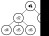

# Fundamentals of Python: Datastructures
## Kenneth A. Lambert - Cengage Learning (2014)

* All examples to be worked through with Python 3.8 using as many of the new 
features as possible

# C01. Basic Python Programming
This was a review of the Python standard library.

# C02. An Overview of Collections

There are several data types that we're already familiar with in Python;
strings, lists, tuples, dictionaries etc.

There are others such as stacks, queues, priority queues, binary search trees,
heaps, graphs, bags and various sorted collections.

They can be *homogenous* (all of the same type) or *heterogenous*.  For most
languages, collections have to be homogenous, but not for Python.

Collections are usually *dynamic*, rather than *static*, they can grow or shrink
depending on need.  They often can change throughout the course of a program,
except of course for *immutable collections*.

We generally categorize them by their structure.

## Collection Types
### Linear Collections
Items in a *linear collection* are like people in a line, ordered by position.  Each (except the first)
has a predecessor and one or zero successors.


### Hierarchical Collections
Family trees and corporate structures are familiar examples of *hierarchical 
collections*.  Each object except the one at the top has a parent, but possibly
 many successors, aka *children*.
 


### Graph Collections
A *graph collection* or more simply, *graph* has objects where each data item
can have many predecessors and many successors.  In Fig 2.3 all objects touching
d4 are both its predecessors and successors, we call these *neighbours*.


### Unordered Collections
In an *unordered collection* there is no particular order at all, no 
predecessors, no successors. Anarchy!


### Sorted Collections.
A *sorted collection* has a *natural ordering* on its items.  Things like
a phone book or roster are examples.  There must be some kind of rule for
comparing items such that `item<sub>n</sub> <= item<sub>n+1</sub>`.  Sorted
lists are the most familiar but a subtype of hierarchical collections, the 
*binary search tree* imposes a natural ordering on its items.

Some operations such as searching can be much more efficient on a sorted
collection than on an unsorted equivalent.

### A Taxonomy of Collection Types

* Collection
  * Graph Collection
  * Hierarchical collection
    * Binary Search Tree
    * Heap
  * Linear collection
    * List
      * Sorted list
    * Queue
      * Sorted queue
    * Stack
    * String
  * Unordered collection
    * Bag
      * Sorted bag
    * Dictionary
      * Sorted dictionary
    * Set
      * Sorted set

### Implementations of Collections
In computer science we call collections *Abstract Data Types* (ADTs).  By
abstracting away the details we don't need to worry about we can concentrate
on the important details about how to most efficiently work with them within
the constraints of both memory and time.

In Python we abstract things by using (in order from smallest to largest forms
of abstractions) functions, methods, classes and modules.

Remember you can always explore the interfaces of a collection type by using
 the `dir()` or `help()` methods on them from a shell prompt.
 
 ```python
>>> dir(list)

['__add__', '__class__', '__contains__', '__delattr__', '__delitem__', '__dir__', '__doc__', '__eq__', '__format__', '__ge__', '__getattribute__', '__getitem__', '__gt__', '__hash__', '__iadd__', '__imul__', '__init__', '__init_subclass__', '__iter__', '__le__', '__len__', '__lt__', '__mul__', '__ne__', '__new__', '__reduce__', '__reduce_ex__', '__repr__', '__reversed__', '__rmul__', '__setattr__', '__setitem__', '__sizeof__', '__str__', '__subclasshook__', 'append', 'clear', 'copy', 'count', 'extend', 'index', 'insert', 'pop', 'remove', 'reverse', 'sort']

>>> help(list)

Help on class list in module builtins:
class list(object)
 |  list(iterable=(), /)
 |  
 |  Built-in mutable sequence.
 |  
 |  If no argument is given, the constructor creates a new empty list.
 |  The argument must be an iterable if specified.
 |  
 |  Methods defined here:
 |  
 |  __add__(self, value, /)
 |      Return self+value.
 |  
 |  __contains__(self, key, /)
 |      Return key in self.
 ...
...
...
```
